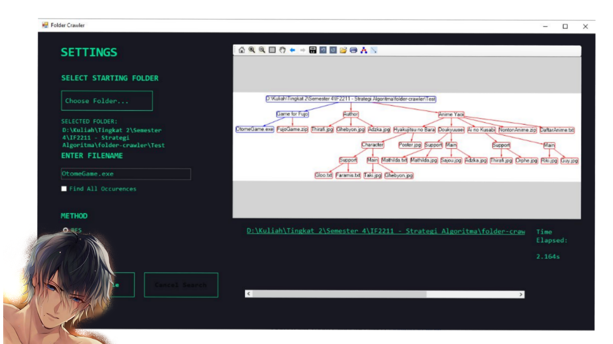

<div id="top"></div>

<br />
<div align="center">
    

  <h2 align="center">FOLDER CRAWLER</h2>

  <p align="center">
    Aplikasi Desktop Folder Crawler dengan BFS dan DFS untuk Tugas Besar 2 Strategi Algoritma
    <br />
    <a href="https://github.com/reverseon/folder-crawler/docs"><strong>Telusuri Dokumen>></strong></a>
    <br />
    <br />

  </p>
</div>


<!-- TABLE OF CONTENTS -->
<details>
  <summary>Table of Contents</summary>
  <ol>
    <li>
      <a href="#tentang-projek">Tentang Projek</a>
      <ul>
        <li><a href="#built-with">Built With</a></li>
      </ul>
    </li>
    <li>
      <a href="#memulai">Memulai</a>
      <ul>
        <li><a href="#prerequisite">Prerequisite</a></li>
      </ul>
    </li>
    <li><a href="#penggunaan">Penggunaan</a></li>
    <li><a href="#author">Author</a></li>
  </ol>
</details>

## Tentang Projek
Program ini merupakan program pencarian folder berupa Aplikasi Desktop Folder Crawler dengan pengaplikasian algoritma Breadth First Search dan Depth First Search dalam pencarian suatu solusinya. GUI menggunakan template Windows Forms App, dan visualisasi graf tree untuk pencarian solusi menggunakan MSAGL.

### Built With
* [Visual Studio](https://visualstudio.microsoft.com/) dengan [.NET](https://dotnet.microsoft.com/en-us/) untuk C#
* [NuGet Package](https://docs.microsoft.com/en-us/nuget/quickstart/install-and-use-a-package-in-visual-studio) untuk MSAGL
* [Library MSAGL](https://github.com/microsoft/automatic-graph-layout)

## Memulai

### Prerequisite

1. Install Visual Studio beserta .NET untuk C# dengan mengikuti proses instalasi standar aplikasi.
2. Install NuGet Package dari repo GitHub: https://github.com/microsoft/automatic-graph-layout dengan Package Manager yang ada di menu Tools > NuGet Package Manager > Package Manager Console. Package Manager Console akan muncul di bagian bawah layar.
3. Install library MSAGL dengan menggunakan command berikut pada Package Manager Console:
  
    ```
    Install-Package AutomaticGraphLayout -Version 1.1.11
    Install-Package AutomaticGraphLayout.Drawing -Version 1.1.11
    Install-Package AutomaticGraphLayout.WpfGraphControl -Version 1.1.11
    Install-Package AutomaticGraphLayout.GraphViewerGDI -Version 1.1.11
    ```

## Penggunaan
1. Jalankan program dengan melakukan Run/Start program pada Visual Studio.
2. Setelah tampilan aplikasi muncul, tekan tombol "Choose Folder" dan pilih Starting Folder.
3. Masukkan filename yang ingin dicari.
4. (Opsional) Toggle "Find All Occurences" bila ingin mendapatkan seluruh hasil dari filename yang dicari.
5. Pilih salah satu method (BFS atau DFS).
6. Klik search file untuk melakukan pencarian. Dapat dilakukan cancel search pada saat pencarian sedang dilakukan.
7. User dapat membuka file explorer melalui hyperlink yang ditampilkan di bawah hasil graf pohon.

## Author
Kelompok : DEEP FUJO SEARCH
- 13520079 Ghebyon Tohada Nainggolan
- 13520127 Adzka Ahmadetya Zaidan
- 13520157 Thirafi Najwan Kurniatama

<p align="right">(<a href="#top">back to top</a>)</p>